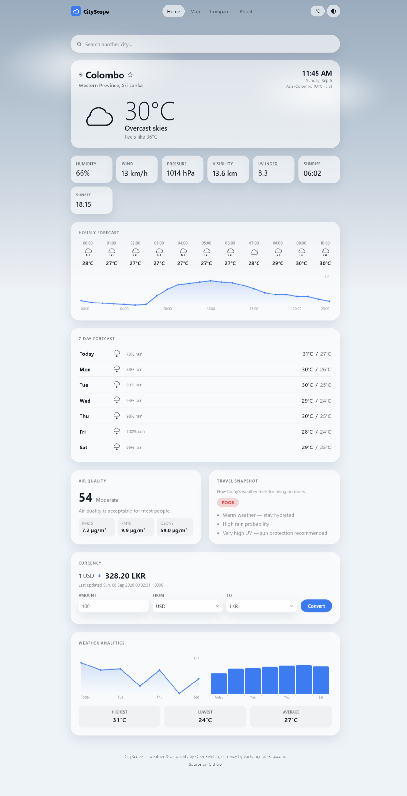
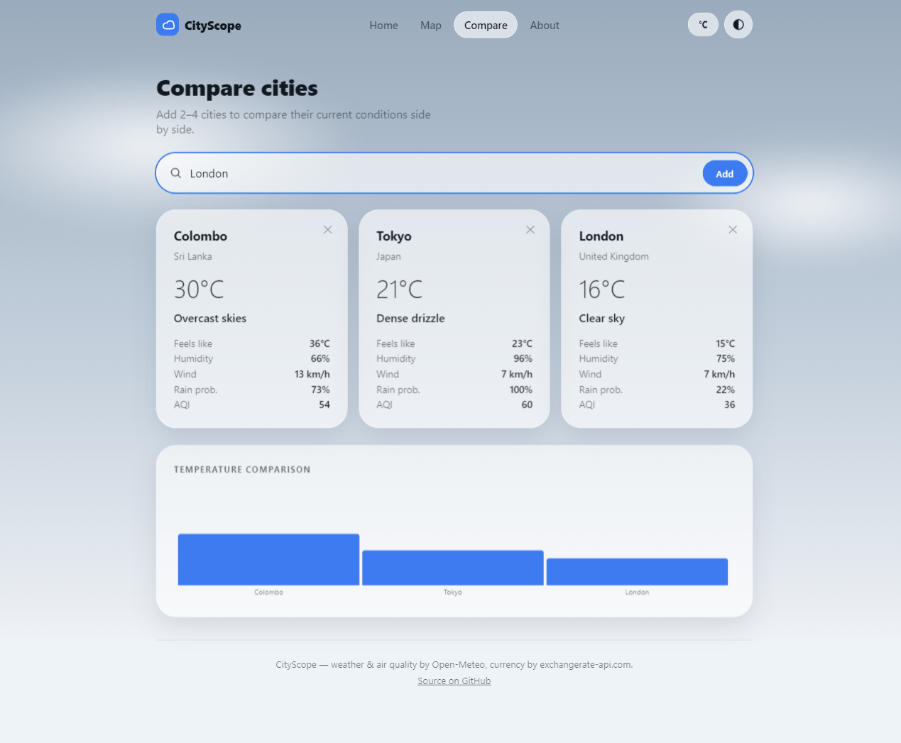
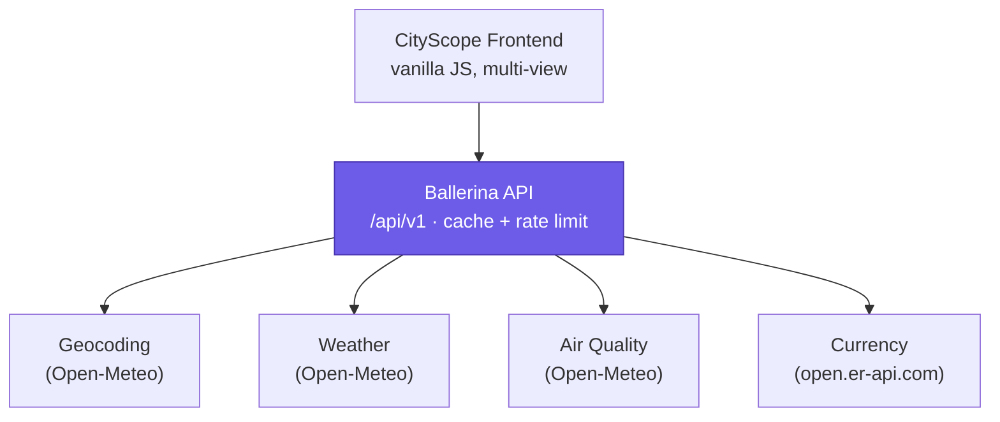

<p align="center"></p>

<p align="center">


</p>

# CityScope

A fast, beautiful city weather and information app. Search any city and see
its current weather, hourly and 7-day forecast, air quality, local time, and
currency — all in one dashboard, with no account or login required.

Originally built as a small Ballerina "integration" project for the WSO2
Engineering Intern application; rebuilt into a full product: the Ballerina
backend now runs a versioned, cached, rate-limited API, and the frontend is a
complete multi-view weather app instead of a single search box.

**Live demo:** https://delightful-mud-0758db600.7.azurestaticapps.net

## Screenshots

Home dashboard — current weather, hourly/daily forecast, air quality,
currency, and analytics for one city:



Compare view — current conditions for 2–4 cities side by side:



## Features

- **City search** with autocomplete and disambiguation (e.g. "Colombo" is a
  city in both Sri Lanka and Brazil — search shows both, and picking one is
  unambiguous even though both share a name)
- **Current weather** — temperature, feels-like, humidity, wind, pressure,
  visibility, UV index, sunrise/sunset
- **Hourly forecast** (next 24h) with a temperature chart
- **7-day forecast**
- **Air quality** (US AQI, PM2.5, PM10, ozone, plain-language category)
- **Local time & timezone**, computed from the city's real UTC offset — never
  guessed from longitude
- **Currency** display and a live converter between any two currencies
- **Interactive map** to search and jump to a city
- **City comparison** (2–4 cities, side by side, with a chart)
- **Weather analytics** — 7-day temperature/rain trend charts and range stats
- **Travel snapshot** — a simple, rule-based read on today's conditions
  (explicitly not AI — see [Technical decisions](#technical-decisions))
- **Recent searches & pinned cities**, stored in `localStorage` only
- **Light/dark mode** and **°C/°F**, the latter defaulting to whichever unit
  the searched city's own country actually uses (Celsius almost everywhere,
  Fahrenheit for the US and a handful of others) until you override it
- **No login, no account, no paywall** — everything works immediately

## Tech stack

- **Backend:** Ballerina (Swan Lake) — HTTP service, concurrent upstream
  calls, in-memory TTL caching, fixed-window rate limiting, unit tests
- **Frontend:** vanilla HTML/CSS/JS, no framework, no build step
- **Map:** Leaflet + OpenStreetMap tiles
- **Data:** [Open-Meteo](https://open-meteo.com/) (geocoding, forecast, air
  quality) and [open.er-api.com](https://www.exchangerate-api.com/) (currency)
  — both free and keyless

## Architecture



`GET /api/v1/snapshot/{city}` geocodes the city once, then fires the weather,
air quality, and currency requests **concurrently** with Ballerina's
`start`/`wait` — none of the three depends on another's result, so they run
in parallel instead of one after another. Weather is essential (its failure
fails the request); air quality and currency are each optional — if one
upstream is down, the snapshot still returns with that field set to `null`
rather than failing outright.

## Caching strategy

A small hand-rolled in-memory TTL cache sits in front of every upstream call,
keyed by coordinates (weather/air quality) or city name (geocoding) or
currency code (FX rates) — never by this service's own derived response
shape, so a cache hit still recomputes weather descriptions/AQI categories
fresh while skipping the network round-trip.

| Data       | TTL     | Why                                          |
|------------|---------|-----------------------------------------------|
| Geocoding  | 24h     | A city's coordinates don't move                |
| Weather    | 5 min   | Balances freshness against upstream load       |
| Air quality| 10 min  | Changes more slowly than weather               |
| Currency   | 30 min  | Exchange rates update a few times a day at most|

## Rate limiting

A single global fixed-window limiter (60 requests/minute by default,
configurable — see `backend/Config.toml.example`) protects the free-tier
upstream APIs, which this whole service shares one quota with regardless of
which caller triggered the request. It's deliberately global rather than
per-client: per-IP limiting would need every resource function to switch to
the manual `http:Caller`-response pattern instead of typed returns, a much
larger change for a demo-scale service.

## API

Base path: `/api/v1`. All responses are JSON; errors are always
`{ "error": { "code", "message", "requestId" } }`.

| Endpoint | Description |
|---|---|
| `GET /health` | Service + upstream status |
| `GET /metrics` | Request counts, cache hit rate, per-upstream error counts |
| `GET /city/search?q=&max=` | Geocoding search — up to `max` (default 5, max 10) candidate cities |
| `GET /snapshot/{city}?currency=` | Full dashboard payload: location, current weather, hourly, daily, air quality, currency |
| `GET /weather/{city}` | Current + hourly + daily forecast only |
| `GET /air-quality/{city}` | Air quality only |
| `GET /currency/convert?amount=&from=&to=` | Currency conversion |

`snapshot`, `weather`, and `air-quality` also accept optional
`lat`, `lon`, `country`, `countryCode`, `region`, `timezone` query params —
the frontend passes these straight from a chosen search result so a specific
"Colombo, Brazil" pick can't silently resolve back to "Colombo, Sri Lanka"
via a fresh by-name geocode.

**Example:**

```
GET /api/v1/snapshot/Tokyo

{
  "location": { "name": "Tokyo", "country": "Japan", "countryCode": "JP", ... },
  "current": { "temperatureCelsius": 27.4, "condition": { "icon": "partly-cloudy", ... }, ... },
  "hourly": [ { "time": "...", "temperatureCelsius": 26.1, ... }, ... ],
  "daily": [ { "date": "...", "tempMaxCelsius": 29.0, "tempMinCelsius": 22.0, ... }, ... ],
  "airQuality": { "usAqi": 42, "category": "Good", "pm25": 8.2, ... },
  "currency": { "baseCurrency": "USD", "targetCurrency": "JPY", "exchangeRate": 156.1, ... },
  "generatedAt": "2026-09-06T04:53:11Z"
}
```

## Project structure

```
backend/
  Ballerina.toml, Dependencies.toml   package metadata
  Config.toml.example                 optional rate-limit overrides (no secrets — nothing needs an API key)
  types.bal                           every record type (upstream + this service's own response shapes)
  weather.bal                         WMO weather-code -> icon/description, AQI category, forecast-shape builders
  currency.bal                        country -> currency code mapping
  cache.bal                           hand-rolled TTL cache
  ratelimit.bal                       fixed-window rate limiter
  errors.bal                          standard error-response builders
  metrics.bal                         in-process request/cache/upstream counters
  validation.bal                      input validation (city name, currency code, amount)
  service.bal                         the HTTP service — read this file first
  tests/                              unit tests (bal test)
frontend/
  index.html
  css/    tokens.css, base.css, components.css, layout.css
  js/     api.js, storage.js, weather-icons.js, charts.js, home.js, map.js, compare.js, main.js
docs/screenshots/
```

## Environment variables

None required — every upstream API is free and keyless. The only
configuration is the rate limiter's thresholds; see
`backend/Config.toml.example`.

## Running locally

1. Install Ballerina: https://ballerina.io/downloads/, then `bal version` to verify.
2. Start the backend:
   ```
   cd backend
   bal run
   ```
   It listens on `http://localhost:8080`.
3. Serve the frontend (plain `file://` will hit CORS issues with `fetch`):
   ```
   npx serve frontend
   ```
   Then open the URL it prints (defaults to `http://localhost:3000`).

The frontend auto-detects `localhost`/`127.0.0.1` and points at
`http://localhost:8080/api/v1`; everywhere else it points at the deployed
backend.

## Testing

```
cd backend
bal test
```

25 unit tests cover input validation, weather-code/AQI mapping, the
forecast-shape builders, the TTL cache (including expiry), the rate limiter,
country→currency lookup, and the error-response shape. These are true unit
tests against pure functions — they don't hit the network, so they're fast
and deterministic. Testing the HTTP resource functions themselves end-to-end
would need the upstream `http:Client`s to be mockable, which they currently
aren't (a documented scope decision, not an oversight — see
[Technical decisions](#technical-decisions)).

Manual QA performed on this rebuild: city search + disambiguation, current
weather, hourly/daily forecast, air quality, currency + converter, map
search, city comparison, weather analytics, recent searches, favorites,
light/dark mode, °C/°F (including per-region auto-default), loading/error
states, API caching (verified via `/metrics`), concurrent upstream calls
(verified via response latency and `/health`), rate limiting (verified by
sending 65 rapid requests — the 60th onward returns `429`), and responsive
layout from ~375px to desktop widths.

## Deployment

The backend runs on Azure App Service (Java 21, Linux) and the frontend on
Azure Static Web Apps (Free tier) — see the live demo link above.

```
# Backend: build a fresh jar, then deploy it directly
cd backend && bal build
az webapp deploy --resource-group <rg> --name <app-name> \
  --src-path target/bin/city_snapshot_service.jar --type jar

# Frontend
npx @azure/static-web-apps-cli deploy ./frontend \
  --deployment-token <token> --env production
```

The App Service is configured with `WEBSITES_PORT=8080` (matching the
Ballerina listener) and no custom startup command — Azure's Java SE runtime
auto-detects and runs the single deployed jar.

## Technical decisions

**Why Ballerina?** Ballerina treats network calls and data shapes as
first-class language features (`http:Client`, records that map directly onto
JSON) instead of library add-ons. For a service whose whole job is calling
other services and reshaping their responses, that removes a lot of
boilerplate you'd otherwise write by hand — and `start`/`wait` makes
"run these three independent calls concurrently" a two-keyword change instead
of a callback/promise/async-await rewrite.

**Why closed records for this service's own types, open records for upstream
response shapes?** Records you define yourself (`CitySnapshot`,
`CurrentWeather`, ...) are closed (`record {| ... |}`) so an unexpected field
is a bug caught at compile time. Records mirroring a third-party API's
response (`GeoResult`, `ForecastResponse`, ...) are open, since you don't
control their schema and don't want a new field on their end to break this
service.

**Why is the rate limiter global instead of per-client?** The thing actually
worth protecting is the free-tier upstream APIs, which this whole service
shares one quota with regardless of caller. Per-IP limiting would force every
resource function onto the manual `http:Caller`-response pattern instead of
typed returns — a much larger change for a demo-scale service.

**Why is "Travel Snapshot" rule-based instead of AI-generated?** It's three
`if` statements over real numbers you can already see elsewhere on the page
(temperature, rain probability, UV, air quality). Calling an LLM API to
restate that as a sentence would add cost, latency, and a point of failure
for zero added insight — see the project brief's explicit "don't pretend
this is AI" requirement.

**Why no historical-weather endpoint?** It was scaffolded (types, a cache
slot) during an earlier pass but never wired to a resource, and nothing in
the current feature set needs it — removed rather than left as dead code.

## Future improvements

- Mock the upstream `http:Client`s to unit-test the resource functions'
  concurrency and partial-failure handling directly
- An OpenAPI spec generated from the service (Ballerina can do this via
  `bal openapi`) for interactive API docs
- Per-IP rate limiting if this ever needs to run somewhere the shared global
  limiter isn't precise enough
- Service-worker caching for offline/flaky-connection use

## Limitations

- No automated end-to-end/browser tests — manual QA only (documented above)
- The rate limiter and caches are in-process and reset on restart; a
  multi-instance deployment would need a shared store (Redis, etc.) instead
- Currency conversion uses `open.er-api.com`'s free tier, which updates once
  every 24 hours — not real-time market rates
